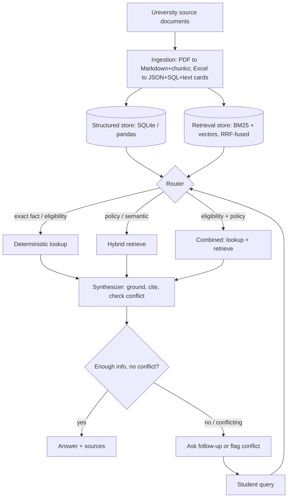

# AI Academic Advisor — Right-Sized Architecture (DATA308)

Sep 25, 2026

## Bottom Line

Flag first: today is **25 Sept 2026**. Assignment #1's submission deadline was **22 Sept 2026 EOD** — already 3 days past, at 2 marks/day penalty — and the presentation is **28 Sept 2026**, 3 days away. If this hasn't been extended, treat everything below as a build-now plan, not a leisurely design exercise.

The draft architecture you pasted is directionally right but scaled for a production enterprise deployment (Neo4j, Elasticsearch, pgvector, GraphRAG, RAPTOR, atomic-claims extraction, a 6-way agent router) — not for a \~5–8 document university corpus that has to run reliably within days. The rubric explicitly rewards a *simpler, well-evaluated* system over a *complex, undertested* one. Recommendation: keep the "multiple representations" idea, but collapse it to two representations (structured + retrieval-text) instead of eight, drop every component that has no query in your corpus to justify it, and spend the time saved on the 20–30 test cases and the four-stage comparison — that's 15 of the 50 marks (Phases 4+5), versus architecture sophistication, which isn't separately graded at all.

## What the Rubric Actually Rewards

Marks total 50 for Assignment #1: implementation and grounding (10), synthetic profiles and edge cases (5), prompt engineering (5), **evaluation and measurement (10)**, comparison/analysis across stages (5), deployment/usability (5), report (5), presentation (5). The rubric states this outright: *"Marks are awarded for the quality of the approach, experimentation, evaluation and analysis — not simply for using more sophisticated technology. A well-designed RAG system that demonstrates strong evidence and evaluation can score higher than a poorly designed but elaborate system."*

Three consequences for architecture decisions:

1. Nothing rewards a graph database, a reranker or a claims-extraction pipeline by name. They only pay off if they visibly change an answer's correctness in your Phase 4 test set — and with a corpus this small, a simpler mechanism produces the same answer.
2. Phase 4 (10 marks) and Phase 5 (5 marks) reward *comparison and measurement*, not the system under test. A basic hybrid RAG system with a rigorous 20–30 case eval scores full marks there; an elaborate graph system with no comparable eval scores zero.
3. Phase 9 — the agentic extension (Regulation Retrieval → Eligibility → Credit Calculation → Recommendation → Verification) — is **Assignment #2**, graded separately (10 of 50 marks, due 3 Nov). Building that pipeline now for Assignment #1 spends time you don't have on marks you can't earn yet.

## Where the Draft Architecture Over-Builds

| Component in the draft | Why it doesn't earn its cost here |
| --- | --- |
| Neo4j / graph database | Prerequisites are already two explicit columns in the semester-spread Excel (course, prerequisites) — that's a graph already. No LLM entity/relation extraction or graph query engine is needed to represent it: a Python dict built straight from the sheet answers "what feeds into ML" and multi-hop chains via a few lines of traversal, in-memory, no server. |
| Atomic claims extraction (an LLM turns every sentence into a subject–predicate–object record) | Doubles ingestion cost (an LLM call per sentence) and adds a new failure mode — the extraction step can itself hallucinate the claim. A citation (doc, section, page) attached to each chunk gives the same "what evidence supports this" answer for a fraction of the engineering. |
| RAPTOR recursive clustering / GraphRAG community summaries | Built for corpora of hundreds of documents where no single retrieval pass covers a "global" question. Your corpus is \~5–8 PDFs and 2 spreadsheets. One summary per document plus section-level chunks covers "explain the programme structure" without a clustering pipeline. |
| Three separate databases (pgvector + OpenSearch + Neo4j) | Each is a service to install, configure and keep running before a single retrieval query runs — days you don't have. Chroma/FAISS (embedded) + rank\_bm25 (a Python list) + pandas/SQLite cover the same ground with zero servers. |
| Mandatory reranker stage | Adds a model and latency for a corpus small enough that top-k from RRF-fused BM25+vector is already precise. Worth one ablation line in the report ("tested a cross-encoder reranker, N% accuracy gain"), not a required pipeline stage. |
| 6-way agent router with a dedicated "Verify" agent | This *is* Phase 9 (Assignment #2, Nov 3). Building it now duplicates work you'll redo later and risks nothing working reliably by the 28th. A single LangGraph flow with conditional edges gives the same reliability behavior (ask when unsure, flag conflicts) without a multi-agent orchestration layer. |

None of this means skip RAG — hybrid retrieval, structured lookups, grounding and conflict detection are all worth keeping. It means: implement the mechanism the query actually needs, not the mechanism with the most literature behind it.

## The Right-Sized Architecture

Three tiers instead of eight layers: a deterministic structured lookup for exact facts, hybrid (lexical + dense) retrieval for semantic/policy questions, and a single thin LangGraph flow that routes between them, grounds every answer in a citation, and asks a follow-up or flags a conflict when it can't answer safely.

No query in this assignment needs more than that. Course/credit/semester facts and eligibility checks are pure code against the structured tables — fast, and impossible to hallucinate. Policy and "why" questions go through hybrid retrieval with citations. Eligibility questions that mix a student's record with a policy caveat use both, and the synthesizer explicitly compares sources before answering — that's the whole "conflict detection" and "insufficiency detection" behavior the assignment asks for, done with a prompt and two cheap checks rather than a claims database and a verifier agent.

## Data → Format Conversion Plan

Same source, two representations — never eight. Every record and chunk carries a lightweight source stub (file name, sheet/page, row/section); that's the entire "provenance layer," a metadata dict, not a database.

| Source | Canonical (structured) | Also produce (retrieval) | Used by |
| --- | --- | --- | --- |
| Academic Regulations / Student Handbook (PDF) | Markdown, headings preserved, tables kept as markdown tables | Section-level chunks + embeddings + BM25, tagged {doc, section, page} | Hybrid RAG (policy questions) |
| Programme Structure (PDF) | Markdown + JSON (programme → core/minor/specialization list) | Section chunks + embeddings + BM25 | Hybrid RAG + structured programme lookup |
| SOP for the semester (PDF) | Markdown + one JSON object per procedure/policy statement (action, condition, steps) | Section/step chunks + embeddings + BM25 | Hybrid RAG + conflict check against Handbook |
| Course Catalogue (if separate) | One JSON record per course (code, title, credits, description, prerequisites, corequisites) + a `courses` table | One auto-written sentence per course, embedded + BM25-indexed | Deterministic lookup + semantic course search |
| Minor Courses (Excel) | One JSON record per minor (id, name, required credits, course list) + `minor_courses` table | One sentence per minor, embedded + BM25 | Deterministic minor-requirement checks |
| Semester-wise Course Offering (Excel: courses, credits, prerequisites) | `course_offerings` table (course, semester, year), merged into `courses` | Same auto-written course sentences, offering info folded in | Deterministic lookup + eligibility checks |
| Synthetic student profiles | JSON per student (completed/failed courses, credits, semester, minor) — one `students` table | Not embedded — looked up, not searched | Deterministic eligibility checks |

## Query Routing & Reliability Logic

Router: keyword/regex first, LLM classification only on ambiguous phrasing — keeps the common case at near-zero added latency.

- Course code, "how many credits," "which semester," a minor's name → **deterministic**: pandas/SQLite lookup, no LLM call for the fact itself, the LLM only phrases the sentence.
- "What does X mean," "explain the attendance policy," "why does the SOP require Y" → **hybrid RAG**: BM25 + vector, RRF-fused top-k, answered from retrieved chunks with citations.
- "Can I take X," "am I eligible for Y," anything needing a student's completed courses *and* a policy caveat → **combined**: deterministic prerequisite/credit check plus retrieved policy text, synthesized together.

Reliability — three mechanisms, all prompt- and code-level, no extra model:

1. **Grounding** — the system prompt requires every claim to cite {document, section/page}; nothing is stated without a matching retrieved chunk or table row.
2. **Insufficiency detection** — triggered when a required student-profile field is missing, or when top retrieval score is below a threshold. In the first case it asks the assignment's own sample follow-up ("What courses have you completed, particularly EDA?") instead of guessing; in the second it says the information is insufficient rather than answering from weak matches.
3. **Conflict detection** — when a combined or hybrid query pulls chunks from two documents that give different values for the same entity, the prompt compares them explicitly: "Handbook (p.X) says A; SOP (p.Y) says B — these conflict; without a stated precedence rule I can't resolve this automatically." No claims database — just a same-entity, different-source check over the handful of chunks already retrieved.

Worked example, matching the assignment's own sample dialogue: *"Can I take Machine Learning next semester?"* → router picks Combined → completed-courses field is missing → follow-up question fires → student answers → deterministic prerequisite check plus a retrieved eligibility policy (e.g. minimum GPA) → synthesizer answers with citations, or flags a conflict if two sources disagree.

## Tech Stack

| Layer | Choice | Why |
| --- | --- | --- |
| Orchestration | LangGraph (required) | One small graph: Router → {Lookup / Retrieve / Combined} → Synthesize → conditional follow-up. \~5 nodes. |
| Embeddings | A small, cheap embedding API (e.g. text-embedding-3-small) or an open-source small model (bge-small) | Corpus is tiny; cost/latency is trivial either way — use whatever API you already have. |
| Vector store | Chroma (embedded, no server) or FAISS | Zero infrastructure to stand up; both support metadata filtering by document/section. |
| Lexical index | rank\_bm25 | Pure Python, in-memory, no server; catches exact course codes/numbers embeddings sometimes blur. |
| Fusion | Hand-written RRF (\~10 lines) | No library needed at this scale. |
| Structured store | pandas DataFrames, or SQLite for SQL | Zero setup; eligibility/credit logic runs as plain code, not LLM reasoning — this is what keeps hallucination near zero on factual questions. |
| LLM | Any compatible LLM API you already use, low temperature | Grounding + insufficiency instructions live in the system prompt; low temperature reduces improvisation. |
| Reranker | Skip by default; keep as one ablation experiment | Report it as tested-but-not-required — feeds Phase 3's "compare prompting/retrieval variants" credit. |
| UI | Streamlit | "Dashboard kind of chatbot": a chat pane plus a sidebar showing retrieved sources, a confidence indicator and a student-profile selector — a day's build, and directly satisfies Phase 6 ("seamless, clear interaction," "source/evidence presentation"). |

## Evaluation Harness

Build one test file (JSON/CSV), 20–30 rows, each with `id`, `query`, `category`, `student_profile_id` (if relevant), `expected_answer_or_outcome`, `expected_source(s)`.

Categories the assignment names explicitly:

- Factual lookup (credits, course codes, semester offered) — 5–6 cases
- Policy/semantic (explain a regulation, attendance rule) — 4–5 cases
- Eligibility/multi-hop (can student X take course Y) — 5–6 cases
- Missing information — **at least 3**, per the assignment's explicit requirement
- Conflicting rules — 3–4 cases (find a real conflict between two source documents, or construct one if the provided set doesn't have one)
- Ambiguous questions — 2–3 cases

Run the same test file against each of the four system stages (Basic LLM → Structured Prompting → RAG → RAG + Structured Student Data) and log, per case, per stage: `is_correct` / `partially_correct` / `unsupported_hallucinated` / `incorrect`, `cited_sources_correct` (bool), `response_time_ms`, `asked_follow_up` (bool), `flagged_conflict` (bool). This is a \~50-line script over the logged JSON, not a framework — output is a comparison table (accuracy %, hallucination rate %, avg response time per stage) plus one or two charts, which is exactly what Phase 4 and Phase 5 ask for.

## Phase-by-Phase Rubric Mapping

| Phase | Marks | What this architecture already gives you |
| --- | --- | --- |
| 1 — Build | 10 | Hybrid RAG + structured lookup, grounded responses with citations |
| 2 — Challenge | 5 | Synthetic profiles (JSON) + the missing-info/ambiguous/conflict test categories above |
| 3 — Prompt engineering | 5 | Compare a bare-context prompt vs. the grounding+constraints+follow-up prompt on the same test set; document the delta |
| 4 — Evaluate | 10 | The 20–30 case harness above, run per stage |
| 5 — Compare/analyze | 5 | The four-stage comparison table (Basic LLM → Prompting → RAG → RAG+Structured) |
| 6 — Deploy | 5 | Streamlit dashboard: chat + sources + confidence + profile selector |
| 7 — Report/PPT | 5 | This document is close to your architecture section already |
| Presentation | 5 | — |

## Build Plan for the Remaining Time

Given the deadline pressure, a tight sequence — assuming you can start today:

**Day 1 — Ingestion + structured layer.** Convert both Excel files to the `courses`/`minor_courses`/`course_offerings` tables and the auto-written text cards; convert the PDFs to Markdown + section chunks with metadata. Build the deterministic lookup functions (credits, prerequisites, eligibility) and test them against a few hand-picked facts.

**Day 2 — Retrieval + orchestration + prompts.** Stand up Chroma/FAISS + BM25 + RRF; write the LangGraph flow (router, three paths, synthesizer, follow-up loop); write and iterate the grounding/insufficiency/conflict prompts; write the synthetic student profiles and wire up the Streamlit UI.

**Day 3 — Evaluation + report.** Build the 20–30 case test set, run it against all four stages, generate the comparison table/charts, and write the report using this architecture as the backbone. Leave a few hours before the presentation to rehearse the demo on 2–3 representative scenarios (normal, missing-info, conflict).

If the deadline was genuinely 22 Sept and hasn't moved, submit whatever is furthest along now and keep improving toward the 28th presentation — the penalty is 2 marks/day, so one more day of polish is usually still worth it up to about day 4–5.

## What to Save for Assignment #2

Assignment #2 (due 3 Nov, presentation 9 Nov) is worth another 50 marks and explicitly asks for the heavier pieces the draft architecture front-loaded into #1:

- **Phase 9 (10 marks)** — the multi-agent pipeline (Regulation Retrieval → Eligibility → Credit Calculation → Recommendation → Verification) belongs here, built on top of the Assignment #1 RAG system, with an explicit comparison of whether the added complexity earns its cost — exactly the question your draft architecture's agent router raises today.
- **Phase 8 (12 marks)** — multimodal extensions (an infographic of a course structure, an audio explanation of a regulation).
- **Phase 10 (10 marks)** — the privacy/security audit, including prompt-injection testing — a natural place to test the sensitive-data handling your draft's "student database" implies.
- **Phase 11 (8 marks)** — copyright/legal analysis of generated outputs.
- A graph database or GraphRAG-style community summaries fit better here too, if your Assignment #1 evaluation shows the in-memory prerequisite dict hitting real limits (a "global" question local RAG genuinely can't answer). Build it only if Phase 5's analysis gives you evidence it's needed, not by default.

A deeper, evidence-first evolution of this architecture, going tab by tab through the full knowledge model, retrieval design, LangGraph orchestration and evaluation plan, is in Final Architecture Decision.
